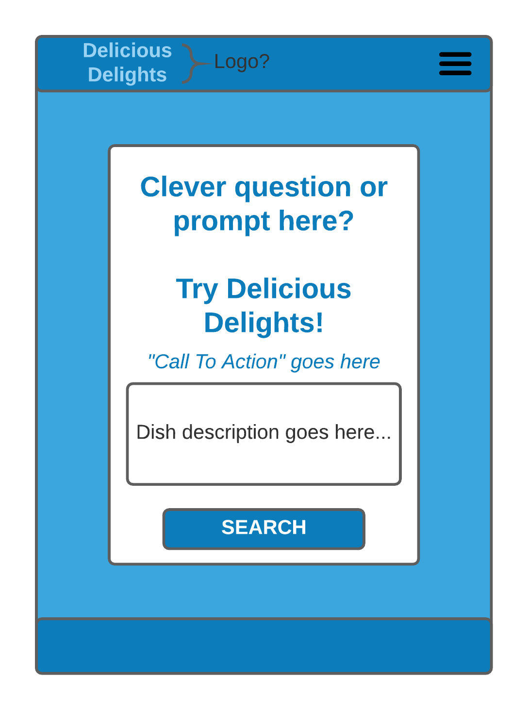
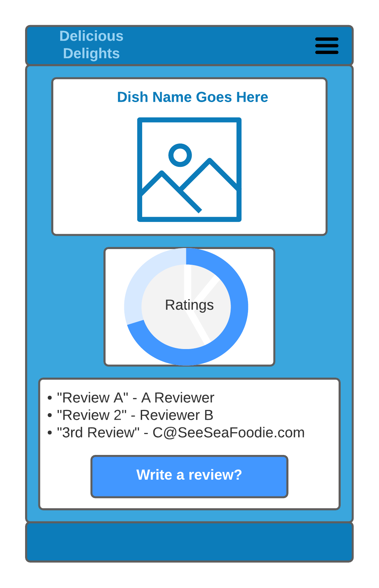
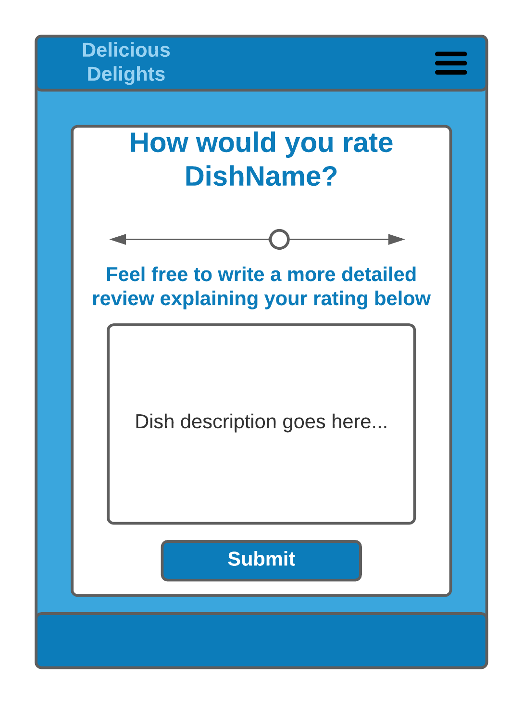

# delightfuldish.com (Crowd sourced food review website)

## User Journeys 

* I love dining out and I often enjoy trying out new dishes that I haven't had before. The problem is that there's often numerous different culinary cuisines to choose from and so it can be difficult to decide just by myself. I found delightfuldish.com and was able to see other foodie reviews and ratings on what's "the most delightful dish" that they've ever tried. It makes making a decision to try new food much easier. 

* Just about everytime I end up at the restaurant, I take my time and figure out what I want from the menu. Sometimes I'll be in a mood for something I haven't tried before but I always do a quick search on google just to see. Unfortunately, it can be time consuming to have to sort through all sorts of random websites and articles just to get an idea of what a particular dish tastes like. I found delightfuldish.com while searching for an entree and it makes seeing what others think about a particular menu item much easier. I can just pull up delightfuldish.com when I'm experimenting the experience at a new or unfamiliar food joint and quickly look up a dish that I'm interested in. Based on what I see on delightfuldish.com, I can more easily make a decision whether to try a particular meal out. 

## Mockups
### Cover Page

### Search Results Page

### Review Page 

